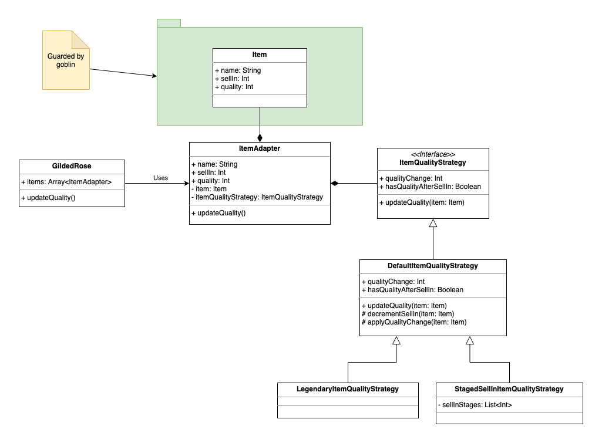

## Original requirements

Hi and welcome to team Gilded Rose. As you know, we are a small inn with a prime location in a
prominent city ran by a friendly innkeeper named Allison. We also buy and sell only the finest goods.
Unfortunately, our goods are constantly degrading in quality as they approach their sell by date. We
have a system in place that updates our inventory for us. It was developed by a no-nonsense type named
Leeroy, who has moved on to new adventures. Your task is to add the new feature to our system so that
we can begin selling a new category of items. First an introduction to our system:

	- All items have a SellIn value which denotes the number of days we have to sell the item
	- All items have a Quality value which denotes how valuable the item is
	- At the end of each day our system lowers both values for every item

Pretty simple, right? Well this is where it gets interesting:

	- Once the sell by date has passed, Quality degrades twice as fast
	- The Quality of an item is never negative
	- "Aged Brie" actually increases in Quality the older it gets
	- The Quality of an item is never more than 50
	- "Sulfuras", being a legendary item, never has to be sold or decreases in Quality
	- "Backstage passes", like aged brie, increases in Quality as its SellIn value approaches;
	Quality increases by 2 when there are 10 days or less and by 3 when there are 5 days or less but
	Quality drops to 0 after the concert

We have recently signed a supplier of conjured items. This requires an update to our system:

	- "Conjured" items degrade in Quality twice as fast as normal items

Feel free to make any changes to the UpdateQuality method and add any new code as long as everything
still works correctly. However, do not alter the Item class or Items property as those belong to the
goblin in the corner who will insta-rage and one-shot you as he doesn't believe in shared code
ownership (you can make the UpdateQuality method and Items property static if you like, we'll cover
for you).

Just for clarification, an item can never have its Quality increase above 50, however "Sulfuras" is a
legendary item and as such its Quality is 80 and it never alters.

## Implementation

* Each `Item` is wrapped by `ItemAdapter. This allows adapting new behavior for the wrapped entities without changing the entity behavior.
* `Quality` business rules are defined by implementation of `ItemQualityStrategy`. This allows segregation of data layer and business logic layer:
    * `DefaultItemQualityStrategy` quality rules are following:
        * Changes item quality by `qualityChange` after each call of `upadteQuality(item: Item)`. Negative `qualityChange` value represents quality degradation and positive value represents quality improvements.
        * If `sellIn` is  negative, then `qualityChange`will be applied second time.
        * Cannot lower item quality below 0.
        * Cannot rise item quality above 50.
        * If `hasQualityAfterSellIn` is `true`, then quality will continue to change after `sellIn` become less than zero. 
        * If `hasQualityAfterSellIn` is `false`, then quality will become `0` after `sellIn` become less than zero.
    *  `LegendaryItemQualityStrategy` represents legendary items. This strategy extending `DefaultItemQualityStrategy` with following exceptions:
        * Item `quality` never changes
            * If quality is predefined out of default allowed ranges, then it should never change 
        * Item `sellIn` never changes as this kind items should never be sold. //TODO: Needs clarifications
    * `StagedItemQualityStrategy` allows definition of list of quality change stages. This strategy extending `DefaultItemQualityStrategy` with following exceptions:
        * After each `applyQualityChange(item: Item)` call strategy compares item `sellIn` value with each value of stages list. For each case when `sellIn` is equal or less than stages list item - `applyQualityChange()`

## TODO

* `Item` interface can be extracted, so `ItemAdapter` can implement it by delegation.
* `ItemRepository` is a make-shift replacement for persistent items data source and should not be considered as a part of implementation